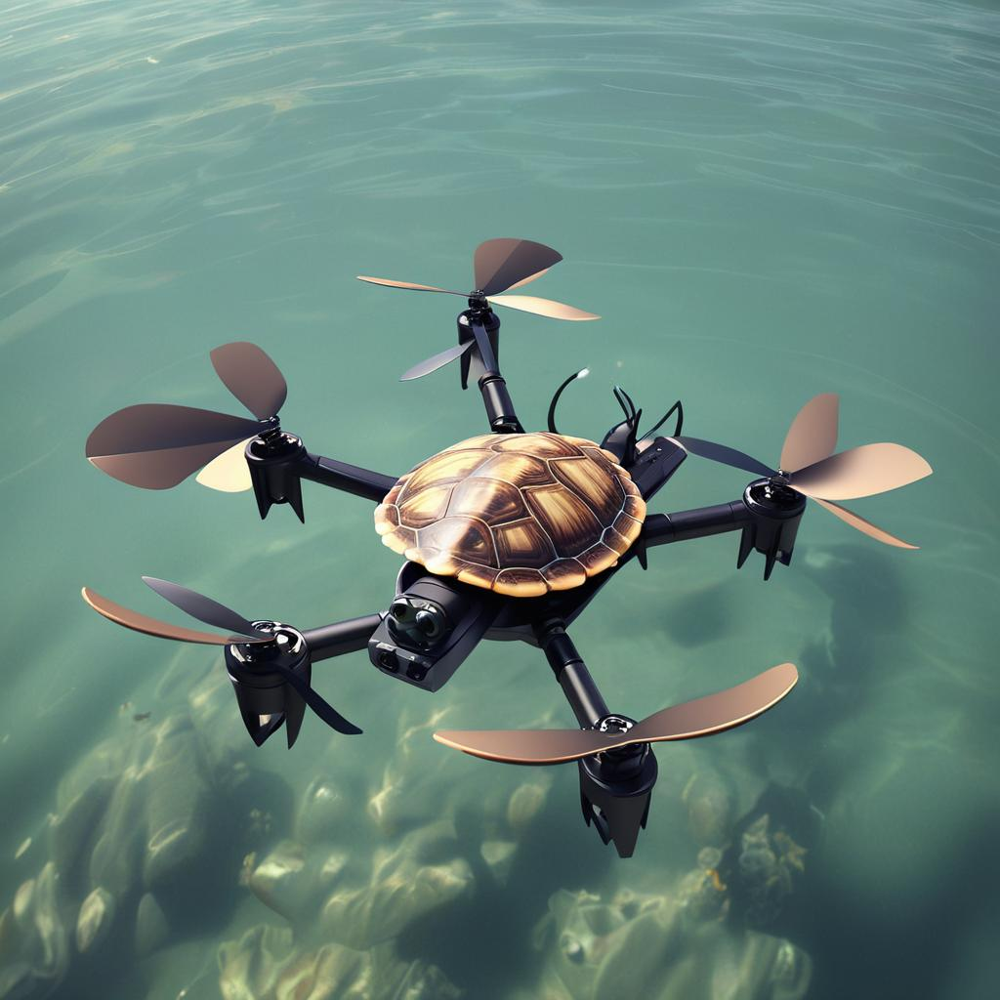

<!-- PROJECT LOGO -->
<figure markdown style="text-align: center">

</figure>

<i>A Python package for managing drone based surveys of marine turtles.</i>

<https://readthedocs.org/projects/turtle-drone/badge/?version=latest>

## Contents

- [Installation](#installation)
- [Usage](#usage)
- [Design](#design)
- [Contributing](#contributing)
- [License](#license)
- [Contact](#contact)
- [Acknowledgments](#acknowledgments)

---

