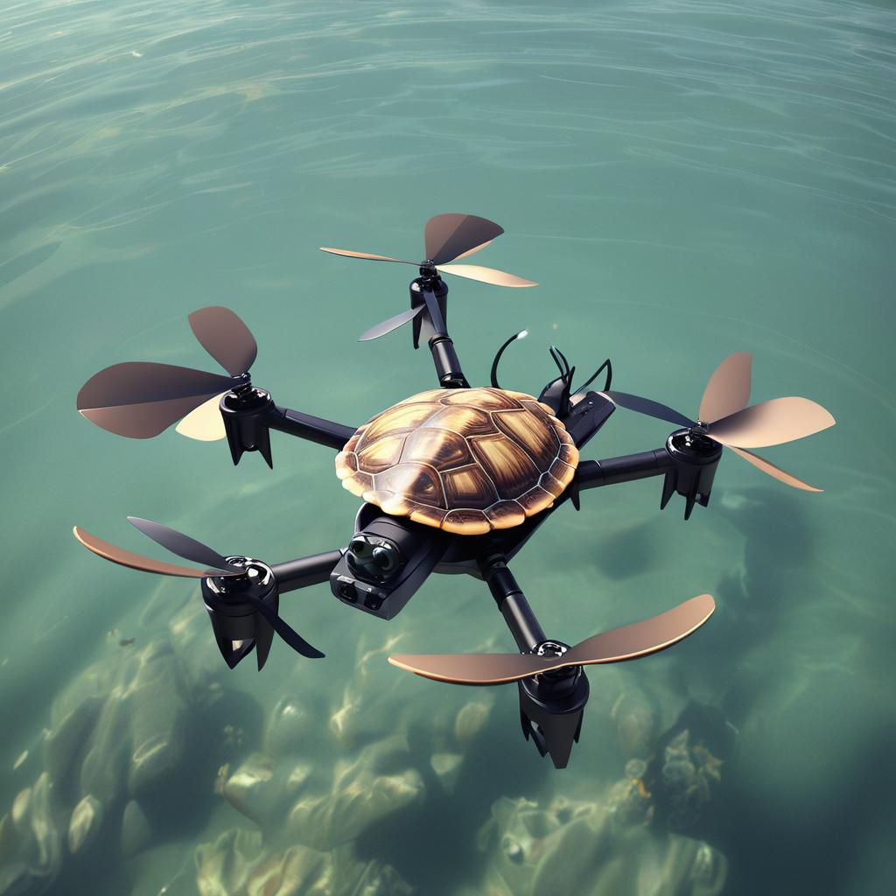

<a name="readme-top"></a>

<!-- PROJECT LOGO -->
<figure markdown style="text-align: center">




</figure>

<div style="text-align: center">

<p><i>A Python package for managing drone based surveys of marine turtles.</i></p>

[](https://readthedocs.org/projects/turtle-drone/badge/?version=latest)


## Contents

- [Installation](#installation)
- [Usage](#usage)
- [Image Classification Tool](#image-classification-tool)
- [Design](#design)
- [Contributing](#contributing)
- [License](#license)
- [Contact](#contact)
- [Acknowledgments](#acknowledgments)

---

## Image Classification Tool

TurtleDrone includes a powerful image classification browser with CLIP embeddings integration for efficient image classification and management. This tool is designed for researchers who need to quickly classify large collections of turtle images using visual similarity and machine learning embeddings.

### Features

- **Smart Image Loading**: Multi-threaded lazy loading with intelligent caching
- **CLIP Integration**: Uses CLIP embeddings for semantic image similarity
- **Visual Classification**: Assign images to classes using keyboard shortcuts (Shift+F1-F12)
- **Crop & Zoom**: Multiple thumbnail sizes and crop options for detailed inspection
- **Similarity Sorting**: Double-click any image to sort by visual similarity
- **Filter & Search**: Filter images by classification status or class
- **Professional UI**: Modern interface with menus, toolbars, and keyboard shortcuts
- **Data Persistence**: Save classifications and hidden flags to NPZ files
- **YOLO Export**: Export classifications as YOLO format annotations

### Quick Start

1. **Generate CLIP embeddings for your images:**
   ```python
   # Use the clip_encode module (details in Installation section)
   python -m turtledrone.labelme.clip_encode /path/to/images/
   ```

2. **Start the image classification browser:**
   ```bash
   python -m turtledrone.labelme.image_qt
   ```

3. **Load your data:**
   - Use `File > Load Embeddings...` (Ctrl+O) to load the NPZ file
   - Use `File > Load Class File...` (Ctrl+Shift+O) to load class definitions

4. **Classify images:**
   - Select images and press `Shift+F1` to `Shift+F12` to assign classes
   - Use `Enter` to assign to the last used class
   - Save with `Ctrl+S`

### Keyboard Shortcuts

#### Navigation & View
- `Ctrl++` / `Ctrl+-`: Increase/decrease thumbnail size
- `Shift+Ctrl++` / `Shift+Ctrl+-`: Increase/decrease crop zoom
- `R`: Reset image order to original
- `Ctrl+Shift+C`: Show all classified images

#### File Operations
- `Ctrl+O`: Load embeddings file
- `Ctrl+Shift+O`: Load class file
- `Ctrl+S`: Save classifications
- `Ctrl+E`: Export YOLO annotations

#### Classification
- `Shift+F1` to `Shift+F12`: Assign selected images to classes 1-12
- `Enter`: Assign selected images to last used class

### Mouse Controls

- **Single Click**: Select image(s)
- **Ctrl+Click**: Multi-select images
- **Double Click**: Sort all images by similarity to clicked image
- **Scroll**: Navigate through large collections

### Creating CLIP Embeddings

Before using the image browser, generate CLIP embeddings for your images:

```python
import clip
import torch
import numpy as np
from PIL import Image
import os

# Load CLIP model
device = "cuda" if torch.cuda.is_available() else "cpu"
model, preprocess = clip.load("ViT-B/32", device=device)

# Process images
image_folder = "path/to/your/images"
embeddings = {}

for filename in os.listdir(image_folder):
    if filename.lower().endswith(('.png', '.jpg', '.jpeg')):
        image_path = os.path.join(image_folder, filename)
        image = preprocess(Image.open(image_path)).unsqueeze(0).to(device)
        
        with torch.no_grad():
            embedding = model.encode_image(image)
            embeddings[filename] = embedding.cpu().numpy().flatten()

# Save embeddings
np.savez_compressed("embeddings.npz", **embeddings)
```

### Workflow Example

1. **Basic Classification Workflow:**
   - Load embeddings and class definitions
   - Set filter to "Unallocated" to see unclassified images
   - Select similar images and assign to classes using Shift+F keys
   - Use double-click to sort by similarity for efficient grouping
   - Save progress regularly with Ctrl+S

2. **Quality Control:**
   - Use different thumbnail sizes to inspect details
   - Use crop options (64px, 128px, none) to focus on specific features
   - Hide poor quality images (excluded from exports)
   - Review classifications using "All Images" filter

3. **Export Results:**
   - Use `File > Export YOLO Annotations...` (Ctrl+E)
   - Creates annotation files compatible with YOLO training

### Performance Features

- **Smart Caching**: Intelligent memory management with LRU eviction
- **Progressive Loading**: Images load as you scroll through collections
- **Background Processing**: Continues loading while you work
- **Multi-threading**: Optimized for large image collections

### Requirements for Image Tool

```bash
pip install PySide6 numpy pillow
pip install git+https://github.com/openai/CLIP.git
```

## Installation

Install base package:

```bash
poetry install
```

Install optional AI tooling (PyTorch + torchvision + Ultralytics):

```bash
poetry install --extras ai
```

Or with pip from an editable checkout:

```bash
pip install -e ".[ai]"
```